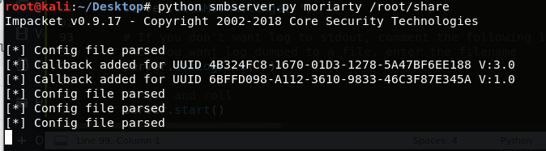
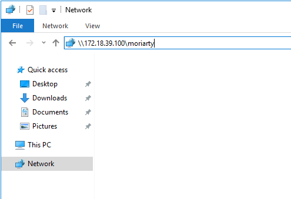
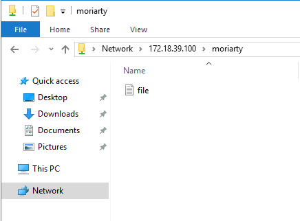
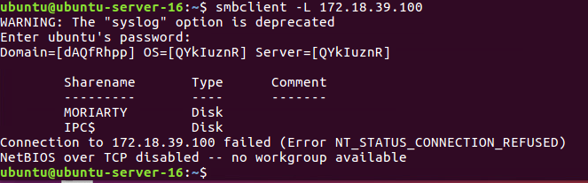

# 6.2 Using SCP

## Using SCP

* First create a file to transfer.
* know the source path of the file : sourcefile
* know the destination path of the file : destinationpath
* know the destination ip of the system : user@hostip

`scp` `sourcefile` `user@hostip`:`destinationpath`

```text
scp file.txt ubuntu@172.18.39.101:~/
```

## Using TFTP

* You need to first setup a tftp server. There are many ways to setup a tftp server.
* Here I will be using metasploit to set up tftp server. I am running kali on this system.
* The other node is running windows, so I will download tftp client in order to get the file.



```text
use auxiliary/server/tftp
set srvhost 192.168.1.108
set TFTPROOT /root/tftp
exploit
```





First create a file "file.txt" in location "/tmp/tftp". This will be our root path of the TFTP server.

Open `msfconsole` and execute the following commands :

```text
use auxiliary/server/tftp
set srvhost 192.168.1.108
set TFTPROOT /tmp/tftp
exploit
```



I had downloaded a tftp client on windows system.

```text
.\tftp -i 172.18.39.100 GET file.txt
```



## Using SMB

You need to share the file using SMB. To do so, we use python to perform this activity. There is a script [smbserver.py](https://raw.githubusercontent.com/SecureAuthCorp/impacket/master/examples/smbserver.py). Just run this python script and it will create an SMB share.

First you need to create a file in /root/share directory to share it with others. Then go to smbserver.py file location and execute the below code.

```text
python smbserver.py moriarty /root/share
```



### For Windows client

On the client side, not that client is only windows. Just go to file explorer and type the ip of the smbserver as below.





### For Linux Client



```text
apt-get install smbclient
```



Then using "smbclient" list the smb share accessible on the SMB server.

```text
smbclient -L 172.18.39.100
```





```text
smbclient //172.18.39.100/moriarty
get file.txt
```




