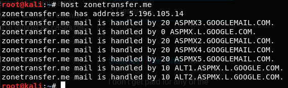
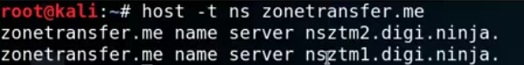
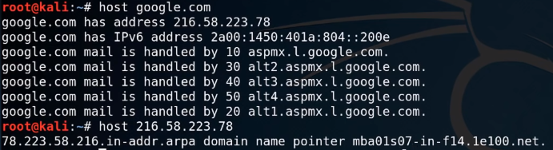

# 3.1.1.1 Basic DNS Enumeration

If you want to do simple DNS enumeration of domain "zonetransfer.me".

```text
host zonetransfer.me
```



If you want to find out the name server NS, associated with domain "zonetransfer.me" then you need to execute the below command in Kali linux.

```text
host -t ns zonetransfer.me
```



## Example 1 :



