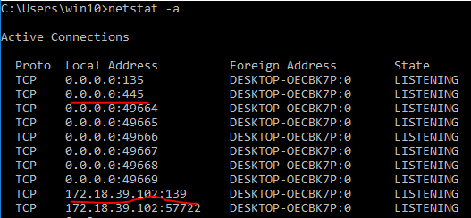
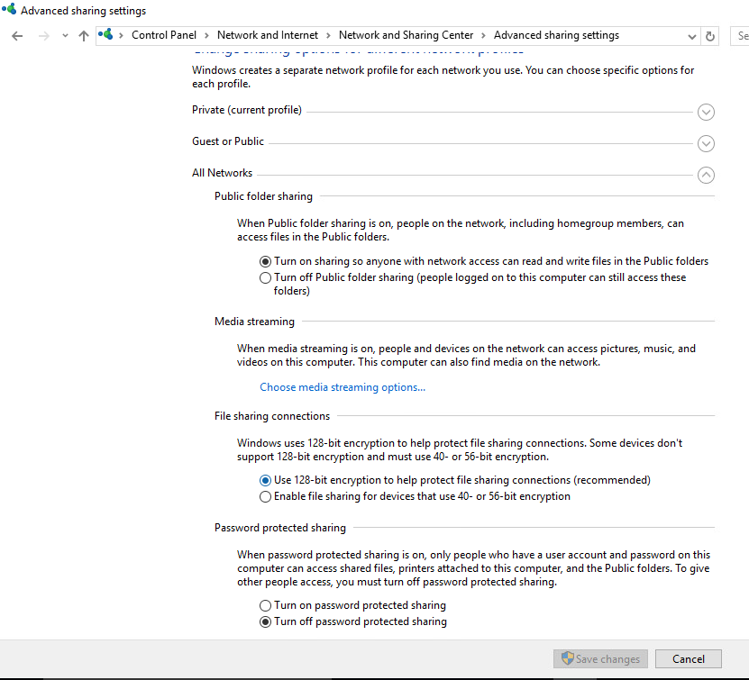
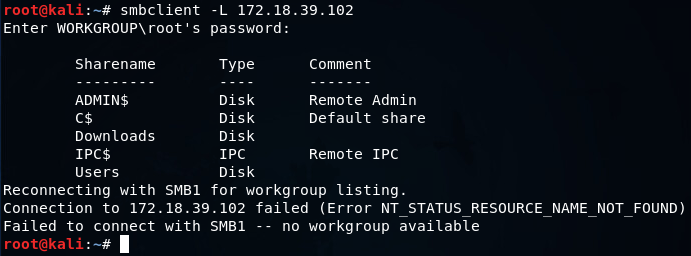

# 3.1.4 SMB Enumeration

## SMB features

* SMB is used to share file and peripherals along the network.

There are two approaches to run SMB service.

1. Running SMB service on top of NetBIOS
   * The SMB service runs on port 139/tcp.
2. Running SMB on top of TCP/IP
   * The SMB service runs on port 445/tcp.

## Pre-requisiste of SMB enumeration

1\) Check if SMB services are running in windows hosts.

2\) The file and sharing service should be enabled on all network so that we could access the shared  files.

3\) If you have not given the proper permissions for sharing you will get the below error.

## SMB Enumeration

