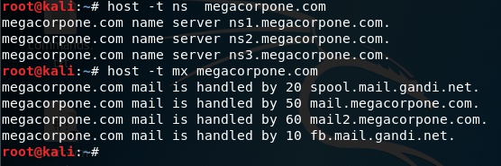

# 3.1.1 DNS Enumeration

Link : [https://digi.ninja/projects/zonetransferme.php](https://digi.ninja/projects/zonetransferme.php)

Tutorial link : [https://www.youtube.com/watch?v=kdYnSfzb3UA](https://www.youtube.com/watch?v=kdYnSfzb3UA)

## Interacting with a DNS server

Nameserver and Mailservers are the most commonly accessable entries in a DNS server.

## Forward Lookup brute force

Generate a list or get a list of common hostnames for the domain like "www", "ftp", "mail", "router", etc.

Later we could code a simple for loop to do the host lookup

## Reverse Lookup Brute force

To do this we need some information of the environment, like the IP ranges to search. Generally, first "Forward lookup Brute force" is done and some useful information is obtained then we do "Reverse lookup Brute force". Here we use an IP range and give it input to host command to find the respective hostnames for the given domain name.

