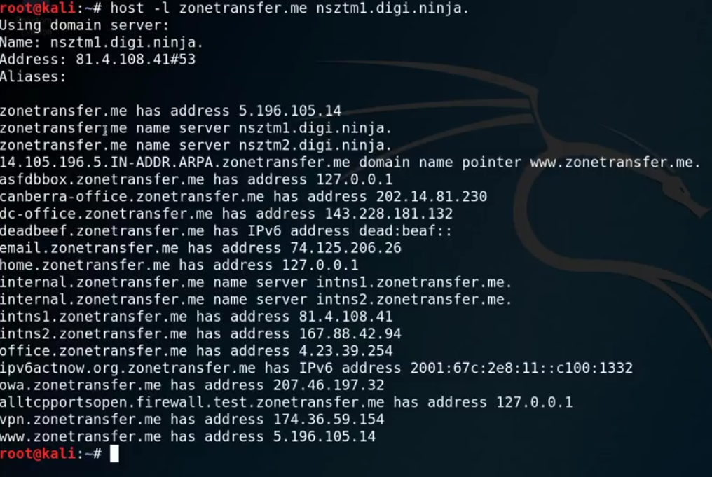
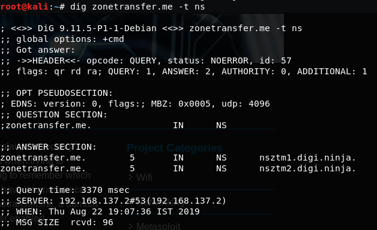
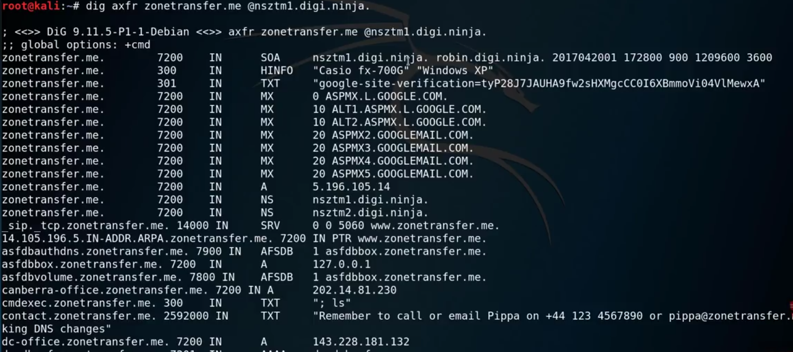
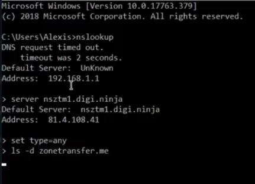

# 3.1.1.2 DNS Zone Transfer

Link : [https://digi.ninja/projects/zonetransferme.php](https://digi.ninja/projects/zonetransferme.php)

Tutorial link : [https://www.youtube.com/watch?v=kdYnSfzb3UA](https://www.youtube.com/watch?v=kdYnSfzb3UA)

Given the zone transfer is enabled \(due to misconfiguration\)

## Checking if the NS is vulnerable to Zone Transfer

This is not the actual zone transfer attack, we are first checking if could perform the zone transfer for the given NS.

### Example 1- Using "host" : yes vulnerable

### Example 2- Using "dig" : yes vulnerable

## Performing Actual Zone transfer

### Example 1 - Using "dig"

### Example 2- Using nslookup

