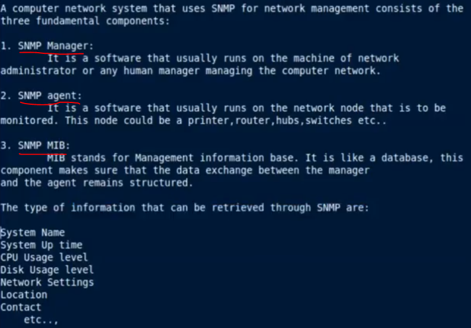
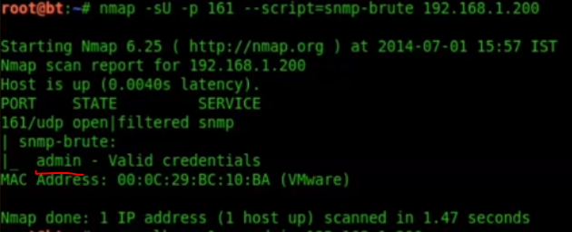
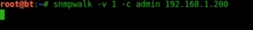
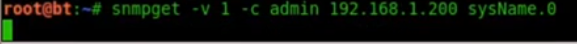
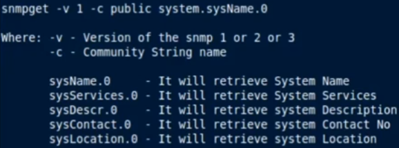
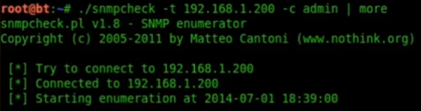

# 3.1.7 SNMP Enumeration

* During SNMP enumeraiton our goal is to find "private community string" \(for older SNMP version untill SNMP 2c\). Once we get the community string, we try to get MIB file information.

## SNMP Features

### SNMP versions

* SNMPv1 - no support for 64 bit counters, only support for 32 bit counters.
* SNMPv2 - support for 64 bit counters.
* SNMPv3 - added security with encryption and authentication.

## MIB file in SNMP

* The SNMP Management Information Base \(MIB\) is a database containing information usually related to network management. The database is organized like a tree, where branches represent different organizations or network functions. The leaves of the tree \(final endpoints\) correspond to specific variable values that can then be accessed, and probed, by an external user.

## Use cases of SNMP Enumeration

* We could use the information present in MIB File to ask the different SNMP devices \(servers, applications, routers, etc\) to share the configuration details. This let us to know internal details of the different devices. It also tells us about information of the client that uses that information.

## Tools Used

1. OneSixtyOne : Community string brute forcing tool.
2. snmpwalk : to query SNMP values.

## Pre-requisites of SNMP Enumeration

### Tools used for SNMP

1. Snmpwalk
   1. Enumerating the entire MIB tree
   2. Enumerating the Windows Users
   3. Enumerating running windows processes
   4. Enumerating Open TCP ports.
   5. Enumerating installed softwares.
2. SnmpGet

### SNMP Community String

We should know the community string before performing SNMP Enumeration. To get the SNMP community string we could use Nmap NSE script for SNMP brute forcing as shown.

The community string is "admin" for the above case.

### Simple SNMP Connection - Using SnmpWalk

### Simple SNMP Connection - Using SnmpGet

## SNMP Enumeration

We use **snmpcheck.pl** for actual snmp enumeration

