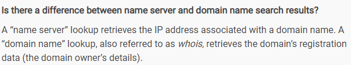

# 1.2 DNS - Terminologies

**Link :** [**https://www.digitalocean.com/community/tutorials/an-introduction-to-dns-terminology-components-and-concepts**](https://www.digitalocean.com/community/tutorials/an-introduction-to-dns-terminology-components-and-concepts)

**Example Link :** [**https://www.youtube.com/watch?v=JDc9IZVFLm0**](https://www.youtube.com/watch?v=JDc9IZVFLm0)\*\*\*\*

* **Top level domain**

A top-level domain, or TLD, is the most general part of the domain. The top-level domain is the furthest portion to the right \(as separated by a dot\). Common top-level domains are "com", "net", "org", "gov", "edu", and "io". Top-level domains are at the top of the hierarchy in terms of domain names. Certain parties are given management control over top-level domains by ICANN \(Internet Corporation for Assigned Names and Numbers\).

* **Hosts**

Within a domain, the domain owner can define individual hosts, which refer to separate computers or services accessible through a domain. For instance, most domain owners make their web servers accessible through the bare domain \(example.com\) and also through the "host" definition "www" \([www.example.com](http://www.example.com/)\).

You can have other host definitions under the general domain. You could have API access through an "api" host \(api.example.com\) or you could have ftp access by defining a host called "ftp" or "files" \(ftp.example.com or files.example.com\). The host names can be arbitrary as long as they are unique for the domain.

* **Sub Domains**

A "subdomain" refers to any domain that is part of a larger domain. Likewise, each domain can control "subdomains" that are located under it. This is usually what we mean by subdomains. For instance you could have a subdomain for the history department of your school at "[www.history.school.edu](http://www.history.school.edu/)". The "history" portion is a subdomain.

The **difference between a host name and a subdomain** is that a host defines a computer or resource, while a subdomain extends the parent domain. It is a method of subdividing the domain itself.

* **Fully Qualified Domain Name \(FQDN\)**

A FQDN is an absolute name that specifies its location in relation to the absolute root of the domain name system. A proper FQDN ends with a dot, indicating the root of the DNS hierarchy. An example of a FQDN is "mail.google.com.".

* **Name Server**

A name server is a computer designated to translate domain names into IP addresses. Name servers can be "authoritative", meaning that they give answers to queries about domains under their control. Otherwise, they may point to other servers, or serve cached copies of other name servers' data.

* **Zone File**

A zone file is a simple text file that contains the mappings between domain names and IP addresses. This is how the DNS system finally finds out which IP address should be contacted when a user requests a certain domain name. A zone file describes a DNS "zone", which is basically a subset of the entire DNS naming system.

Zone files reside in name servers and generally define the resources available under a specific domain, or the place that one can go to get that information.

The zone's `$ORIGIN` is a parameter equal to the zone's highest level of authority by default. So if a zone file is used to configure the "example.com." domain, the `$ORIGIN` would be set to `example.com.`.

* **Records or Host Records**

Whenever we say just "DNS record" we refer to A or AAAA records. Within a zone file, records are kept. In its simplest form, a record is basically a single mapping between a resource and a name. These can map a domain name to an IP address, define the name servers for the domain, define the mail servers for the domain, etc.

* **Domain Name Pointer**

Used for reverse lookup, from IP address to DNS domain names.

* **Resolving Name Server**

the requester will be what we call a "resolving name server". A resolving name server is one configured to ask other servers questions. It is basically an intermediary for a user which caches previous query results to improve speed and knows the addresses of the root servers to be able to "resolve" requests made for things it doesn't already know about.

## **Domain name** vs **Name servers**

Domain name - Logical Entity. Administrative grouping. Label given. Just a name, or information. They do not active take part in DNS lookup, these are parameter that we use while DNS lookup. They are not server, just information.

Name server - Is the real deal in networking, we have hierarchy of name server \(bill, john, fred, jane\). These are the only entities that perfrom DNS resolution.

