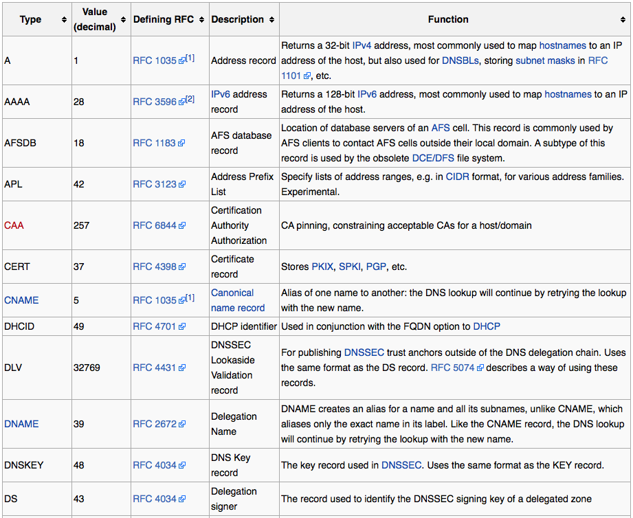
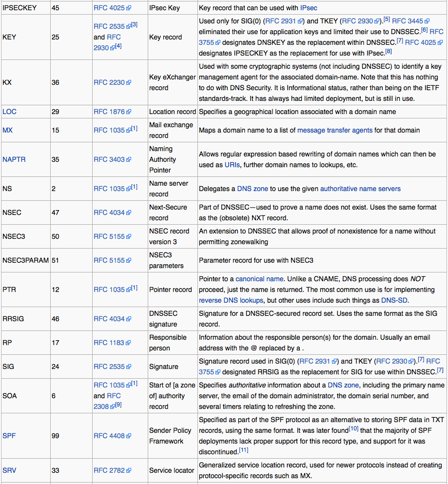
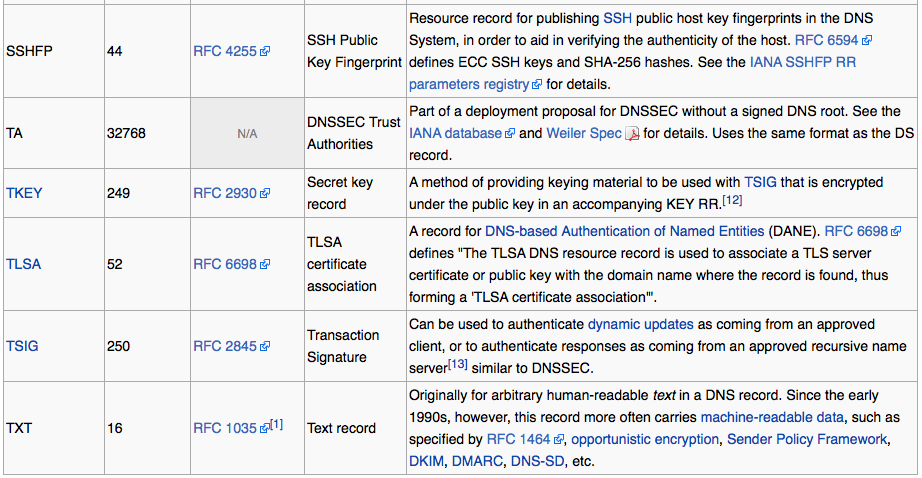
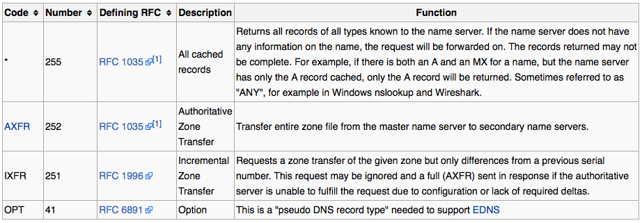
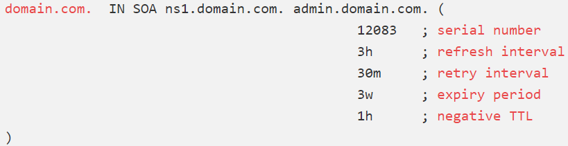
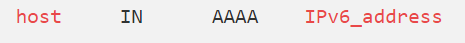
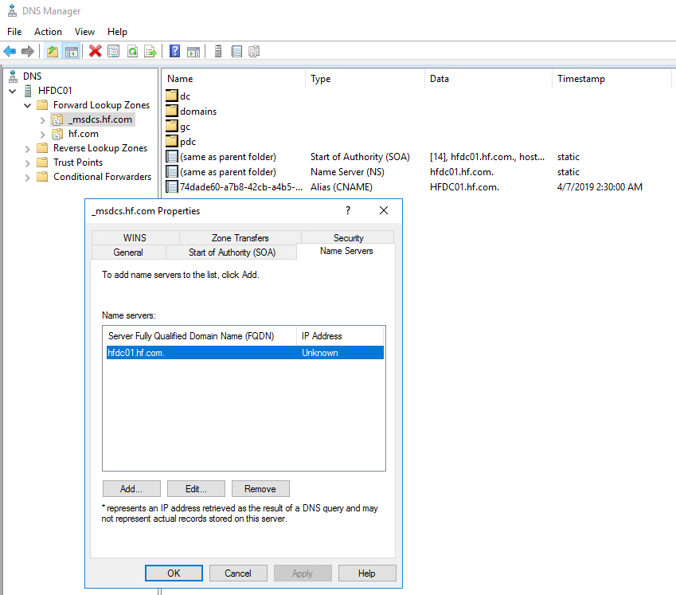
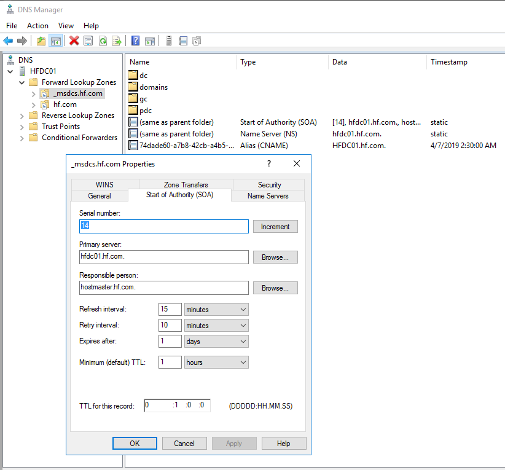
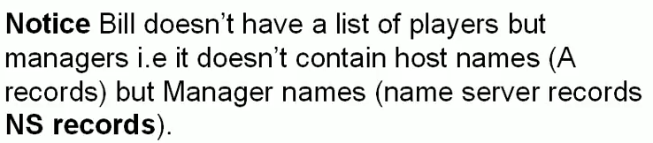

# 1.4 DNS - Record Types

**I have mentioned only some of the record types in details that are common.**









A zone file is where the records are stored, there are many record types.

### **1\) SOA Records**

The Start of Authority, or SOA, record is a mandatory record in all zone files. It must be the first real record in a file \(although $ORIGIN or $TTL specifications may appear above\).



### **2\) A Records**

The "A" record is used to map a host to an IPv4 IP address


All the **domain names with subdomain as "www" will resolve to an "A record"**. Example -

```text
nslookup www.google.com
```

This will give us output as an "A record", where we will get an IPv4 address of google.com.

### **3\) AAA Records**

The "AAAA" records are used to map a host to an IPv6 address



Example :

```text
ns1     IN  A       111.222.111.222
```

Notice that we don't have to give the full name. We can just give the host, without the FQDN and the DNS server will fill in the rest with the $ORIGIN value.

### **4\) CNAME Records**

Similar to High Availability. For example you have a NS named NS-1 which satisfies all your hosts queries. Let say you want to upgrade this NS-1 so that it will have more capacity. But for this, you need to replicate the current NS-1 files to a different NS server named NS-2. And also you need to set the configuration that, all request coming to the current NS-1 will transferred directly to the different NS-2 server. For this configuration you have to tell a CNAME for NS-1 is NS-2.

People also use CNAME to hide the identity of the real name server.

CNAME records define an alias for canonical name for your server \(one defined by an A or AAAA record\). It gives information whether a domain is mapped to some other domain or not.

For instance, we could have an A name record defining the "server1" host and then use the "www" as an alias for this host:

```text
server1     IN  A       111.111.111.111
www         IN  CNAME   server1
```

### 5\) MX Records <a id="mx-records"></a>

MX records are used to define the mail exchanges that are used for the domain. This helps email messages arrive at your mail server correctly.

**For every MX record you need to have an A record or host record**. Example for MX record "MX 10 mailserverA.willpanek.com." you need to have an A record "mailserverA.willpanek.com. IN A 213.10.10.10"


**6\) NS Records**

This record type defines the name servers that are used for this zone.



**7\) PTR Records**

The PTR records are used define a name associated with an IP address. PTR records are the inverse of an A or AAAA record.

**8\) CAA Records**

CAA records are used to specify which Certificate Authorities \(CAs\) are allowed to issue SSL/TLS certificates for your domain.

**9\) SRV Records**

Service location \(SRV\) record. There are many services running in the network. Example of services -

* Global Catalog Service.
* Authentication services.

When nodes in a network respond to DNS queries they also tell the services that are running inside them. When the server gets this response, it creates a SRV record of that particular service against that node.

**10\) TXT Records**

Text Record. Resource record. Custom record, used to associate a text string with a host. What is SPF TXT record? These records help to _prevent spoofing on the system_.

**11\) SOA Records**

Start of Authority Record. Every zone has a SOA record. It tells the DSN server who is the owner is of the zone with the zone information.





## What is a difference between a **record** and a **NS record**?



