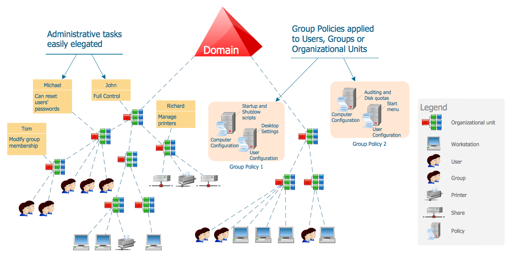

# 3. LDAP

## Active Directory

* Active Directory is the service provided by windows domain controller.
* The need of AD is to connect windows domain accounts and perform search for various information.
  * Example of this could be, you are an organization with with 10,000 employee. You want to create username and passwords for your employee to login. Will you would go to each and every computer and set a user/password? if yes then what if you want to enforce password policies and other rules? To solve these question. We create all username and password using domain controller. We tell the windows domain account their passwords after creating one. This communication is carried out using LDAP protocol.

LDAP runs on the below TCP ports

1. 389/tcp - plain text communication
2. 636/tcp - encrypted communication

