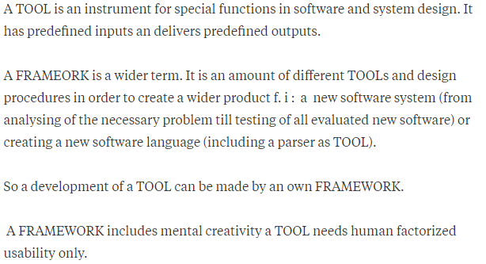

# 7. Metasploit Framework

## What is the difference between a **tool** and a **framework**

## What is Metasploit Framework?

Metasploit is a penetration testing framework that enables you to find, exploit, and validate vulnerabilities. It could be used in any phases of phase of penetration testing.

### Example of a methodology without pentest framework and one with pentest framework.



If we perform pentesting without using a pentest framework then the steps that once could follow is as follows:

1. Passive information gathering - Using 
   1. google web search tool
   2. harvester tool
   3. whois tool 
2. Active information gathering - Using
   1. nmap tool
3. Vulnerability scanning - Using 
   1. nmap tool
   2. OpenVAS tool
   3. nikto tool
4. Exploit
   1. Using different method of running a reverse shell
   2. other methods and tools
5. Reporting - reporting tool 



Using pentest framework all the pentest steps could be done using a single software. For example metasploit.

1. Passive information gathering - Metaspliot has a modules using which we could gather information passively.
2. Active information gathering - We could run nmap using metasploit and could easily import result without the need of running nmap seperately for active information gathering. The advantage of this is that all your tasks are performed on the same terminal window.
3. Vulnerability scan - Metasploit has modules that could perform a vulnerability scan.
4. Exploit - Metasploit has modules that could perform exploitation.
5. Report - Metasploit has modules that could help in reporting also.



I have written an example to get more detail of methodology.

## Advantages of using pentest framework

* We could easily use results obtained from nmap to other tools directly without the need of writing a script to do so. We also do not have to worry of parsing the output so that the new module would accept this. 
* If some features are not present in metasploit, we could develop metasploit modues for more automation of daily tasks with full customization based on the users need.

