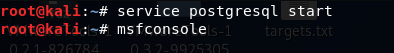
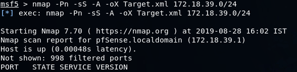
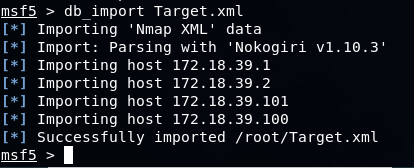
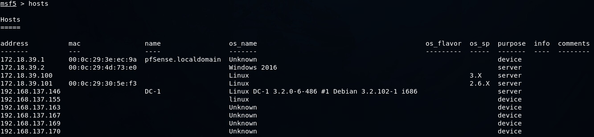
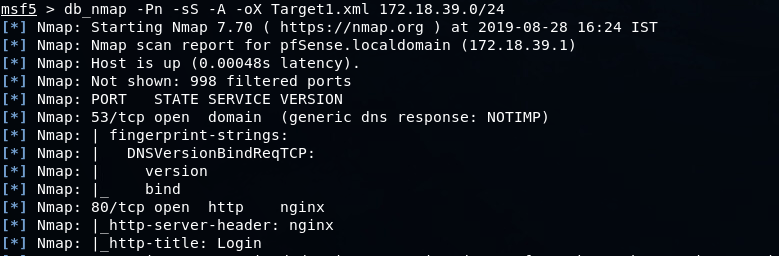
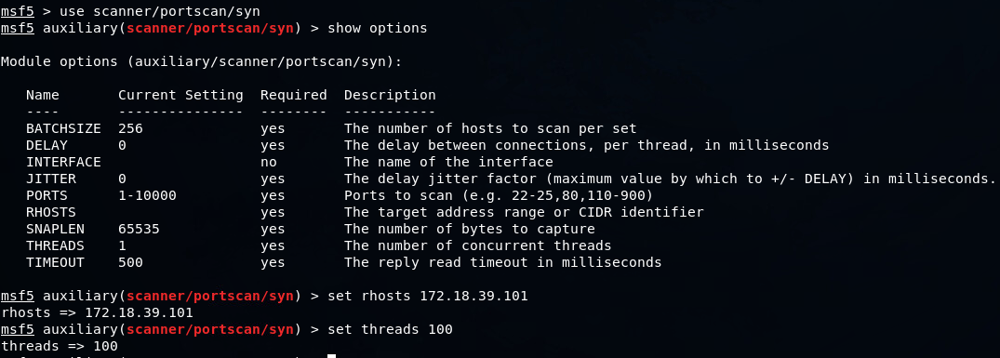
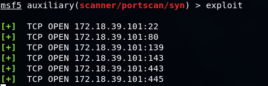
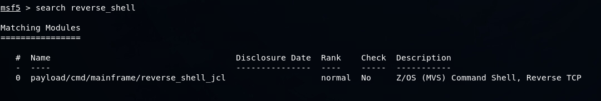

# Example

## Step 1 : Starting metasploit



```text
service postgresql start
msfconsole
```





## Step 2 : Information gathering \(host discovery\) - using nmap with metasploit

source : [https://resources.infosecinstitute.com/information-gathering-using-metasploit/\#gref](https://resources.infosecinstitute.com/information-gathering-using-metasploit/#gref)

```text
nmap -Pn -sS -A -oX Target.xml 172.18.39.0/24
```

* `-Pn` will not run host discovery and only run port discovery.
* `-sS` will only run SYN scan for stealth reasons.
* `-A` enables OS detection, version detection, script scanning, traceroute.
* `-oX` generates a report of scanning results in .xml file. In this case "Target.xml" file



### We then import the generated "Target.xml" file to metasploit backend database.

```text
db_import Target.xml
```



To verify the imported hosts, use the below commands.

```text
hosts
```



## Step 2 : Information gathering \(host discovery\) - using db\_nmap with metasploit \(alternative method\)

### Using db\_nmap

We should be able to enter the db\_nmap command from within msfconsole to run Nmap and have its results automatically stored in our new database.



To verify the imported hosts, use the below commands.


## Step 2 : Information gathering \(port scanning\)

Metasploit has several port scanners built into its auxiliary modules. For the purpose of example we use one of the port scanner `scanner/portscan/syn`

```text
use /scanner/portscan/syn
set rhosts 172.18.39.101
set threads 100
```



* `use scanner/portscan/syn` it selects the `syn` module present in directory `scanner/portscan.`
* `show options` it list the arguments that this module contains. We could change the arguments using the `set` command.
* `set rhosts 172.18.39.101` it is similar to rhosts=172.18.39.101
* `set threads 100` it is similar to threads=100
* To run the module, we use the below command.

```text
exploit
```



## Step 3 : Vulnerability Scanning

source : [https://resources.infosecinstitute.com/vulnerability-scanning-metasploit-part-2/\#gref](https://resources.infosecinstitute.com/vulnerability-scanning-metasploit-part-2/#gref)

Example of this could be openvas in metasploit. Metasploit takes the help of open vas for its vulnerability scanning needs.

## Step 4 : Exploit

metasploit has many exploit inbuild in it. It is constantly update by its governing community. It is one of the strong points of metasploit.

The process is very similar we identify a vulnerability in a system. We then find an exploit against that vulnerability using metasploit `search` command.



Then after figuring out the exploit, use similar steps that were taken in step 2 to set the arguments and run the exploit.

## Step 5 : Report

Metasploit GUI provides the functionality of report. But none-the-less there could be modules available that I am not aware of which perfroms Reporting tasks. If not then we could always develop a module to accomplish this.

