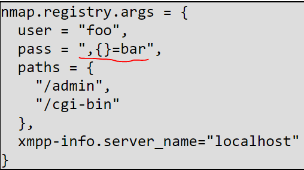

# 8.2.2 NSE Command Line Arguments

## -sC

`-sC`

is equivalent to `--script=default` to enable the most common/default scripts. Some **scripts in default scripts are malicious and are not safe**.



```text
nmap -sC 172.18.39.101
```



In order to know what a script does



```text
nmap --script-help=vuln
```



## --script

`--script <filename> | <category> | <directory> | <expression> [,...]`

* Runs a script scan using the comma-separated list of filenames, script categories, and directories. 
* Each element in the script expression list may be prefixed with a `+` character to force the given script\(s\) to run regardless of the conditions in their `portrule` or `hostrule` functions.
* The argument `all` will execute all scripts in the Nmap script database, but should be used cautiously since Nmap may contain malicious scripts.
* See [script selection](8.2.3-script-selection.md) for more details on how the arguments will be passed.



```text
nmap --script=vuln 172.18.39.101
```





```text
nmap --script +ms-sql-config 172.18.39.102
```





```text
nmap --script smb-os-discovery --script-trace example.com
```





```text
nmap --script snmp-sysdescr --script-args creds.snmp=admin example.com
```





```text
nmap --script mycustomscripts,safe example.com
```



## --script-args and --script-args-file

`--script-args <args>`

* Provides arguments to the scripts.
* Arguments are provided to scripts as a table in the registry called `nmap.registry.args`

`--script-agrs-file`

* It is same as `--script-args` except you provide the same argument text in a file.



```text
nmap -sC --script-args 'user=foo,pass=",{}=bar",paths={/admin,/cgi-bin},xmpp-info.server_name=localhost'
```





## --script-help

`--script-help <filename> | <category> | <directory> | <expression> | all [,....]`

* Shows help about scripts
* prints the script name, its categories, and its description of all the script present.
* `-oX` option, XML representation of the script will be written to a file.
* See [script selection](8.2.3-script-selection.md) for more details on how the arguments will be passed.



```text
nmap --script-help=vuln
```





```text
nmap --script-help "afp-* and discovery"
```





```text
nmap --script-help=vuln -oX output.txt
```



## --script-trace

`--script-trace`

* all incoming and outgoing communication performed by scripts is printed.
* information such as protocol, source and target addresses, and the transmitted data will be printed
* Specifying `--packet-trace` enables script tracing too.

## --script-updatedb

`--script-updatedb`

* This option updates the script database found in `scripts/script.db`
* Only necessary if you have added or removed NSE scripts from the default `scripts` directory

