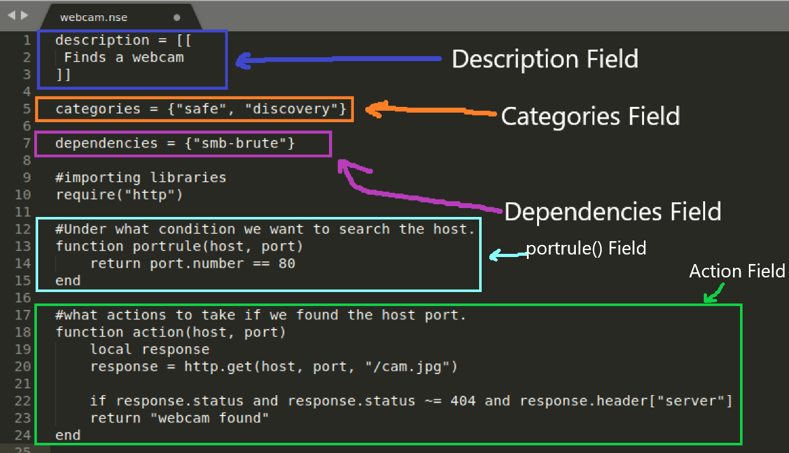

# 8.3 Writing NSE Scripts

## NSE Script Format

1. **`description` Field -** Describes the script 
2. **`categories` Field -** Specify category to which the script belong
3. **`author` Field -** Script's author name _\*\*_
4. **`license` Field -** Legal permission of contributed valuable scripts. Do not help in NSE script action.
5. **`dependencies` Field -**  The `dependencies` field is an array containing the names of scripts that should run before this script
6. **`action` Field -**  the instructions to be executed when the script's prerule, portrule, hostrule or postrule triggers.



## NSE Script Environment Variables

Each script has its own environment variable.

1. **SCRIPT\_PATH -** Shows script path
2. **SCRIPT\_NAME -** Shows the name of the script
3. **SCRIPT\_TYPE -** this environment variable will show which rule \(prerule, postrule, hostrule, portrule\) has activated the script. Useful when script share some code between different Script Scan phases.



```text
local arg1 = stdnse.get_script_args(SCRIPT_NAME..".arg1")
```



