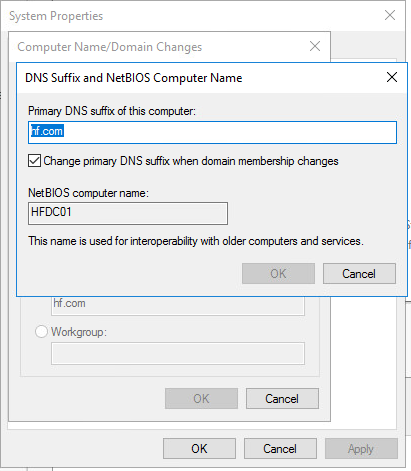
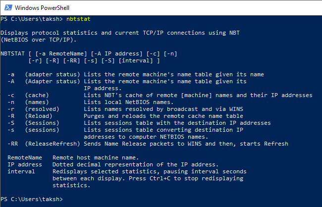

# index

**Link :** [https://en.wikipedia.org/wiki/NetBIOS](https://en.wikipedia.org/wiki/NetBIOS)

**Link :** [http://www.rhyshaden.com/netbios.htm](http://www.rhyshaden.com/netbios.htm)

* Used for communicating with nodes in a network.
* NetBIOS is an API
* As it is an API hence, developers could develop application that could use NetBIOS API to communicate with other neighbor in the network.
* Currently windows used NetBIOS over TCP/IP \(NBT\). NetBIOS feature currently three groups of services.
  * name service, 137/udp and 137/tcp
  * datagram service, 138/udp
  * session service, 139/tcp
* NetBIOS names are unique names, that identify your computer in a network.
* SMB service runs on top of NetBIOS
* NetBIOS name features
  * NetBIOS name = computer name.
  * only capital letters are allowed
  * maximum 16 characters, including one hidden character at the end of the computer name.
  * automatically adds a hidden character at the end of the computer name.
  * WINS service \(in Windows OS\) uses NetBIOS name. WINS is a name resolution service

\*\) We use **nbtstat** to get information on NetBIOS.

