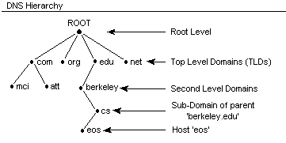
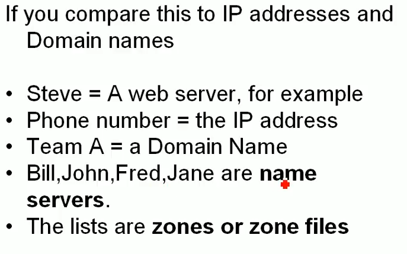

# 1.3 DNS - Hierarchy

**Example Link :** [**https://www.youtube.com/watch?v=JDc9IZVFLm0**](https://www.youtube.com/watch?v=JDc9IZVFLm0)

Examples of domain names, note the dots at the last of these FQDN.

* www.berkeley.edu.
* www.att.com.
* www.cs.berkeley.com.

DNS NS hierarchy is like **a database**, where data is stored in hierarchical fashion.

1\) **Root level NS**

At the top of this system is what are known as "root servers". Root servers handle requests for information about Top-level domains. So if a request comes in for something a lower-level name server cannot resolve, a query is made to the root server for the domain.

> So if a request for "[www.wikipedia.org](http://www.wikipedia.org/)" is made to the root server, the root server will not find the result in its records. It will check its zone files for a listing that matches "[www.wikipedia.org](http://www.wikipedia.org/)". It will not find one. It will instead find a record for the "org" TLD and give the requesting entity the address of the name server responsible for "org" addresses.

2\) **Top Level Domains \(TLD\) NS**

The requester then sends a new request to the IP address \(given to it by the root server\) that is responsible for the top-level domain of the request.

> So, to continue our example, it would send a request to the name server responsible for knowing about "org" domains to see if it knows where "[www.wikipedia.org](http://www.wikipedia.org/)" is located. Once again, the requester will look for "[www.wikipdia.org](http://www.wikipdia.org/)" in its zone files. It will not find this record in its files. However, it will find a record listing the IP address of the name server responsible for "wikipedia.org". This is getting much closer to the answer we want.

3\) **Domain-Level Name Servers**

At this point, the requester has the IP address of the name server that is responsible for knowing the actual IP address of the resource.

> It sends a new request to the name server asking, once again, if it can resolve "[www.wikipedia.org](http://www.wikipedia.org/)". The name server checks its zone files and it finds that it has a zone file associated with "wikipedia.org". Inside of this file, there is a record for the "www" host. This record tells the IP address where this host is located. The name server returns the final answer to the requester.

## Working of a Resolving Name Server

Basically, a user will usually have a few resolving name servers configured on their computer system. The resolving name servers are usually provided by an ISP or other organizations. For instance [Google provides resolving DNS servers](https://developers.google.com/speed/public-dns/) that you can query. These can be either configured in your computer automatically or manually.

When you type a URL in the address bar of your browser, your computer first looks to see if it can find out locally where the resource is located. It checks the "hosts" file on the computer and a few other locations. It then sends the request to the resolving name server and waits back to receive the IP address of the resource.

The resolving name server then checks its cache for the answer. If it doesn't find it, it goes through the steps outlined above.

Resolving name servers basically compress the requesting process for the end user. The clients simply have to know to ask the resolving name servers where a resource is located and be confident that they will investigate and return the final answer.

Example 1 :

**\*\) What if john want to know information of team B members?**

For this john do not need to remember all the NS in the hierarchy above it. It just need one NS information that is the root NS.

**\*\) Will this approach not lead to a lot of queries being made to root level NS?**

Yes this will cause a lot of queries to the root level NS. But for this we have cluster of root NS with the same IP address mirrored for load balancing. Also there are caches from previous results, which limit the number of queries to the root level NS.

