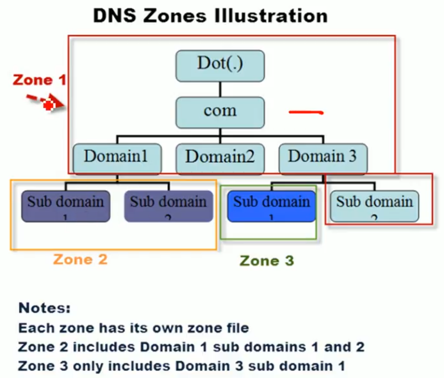
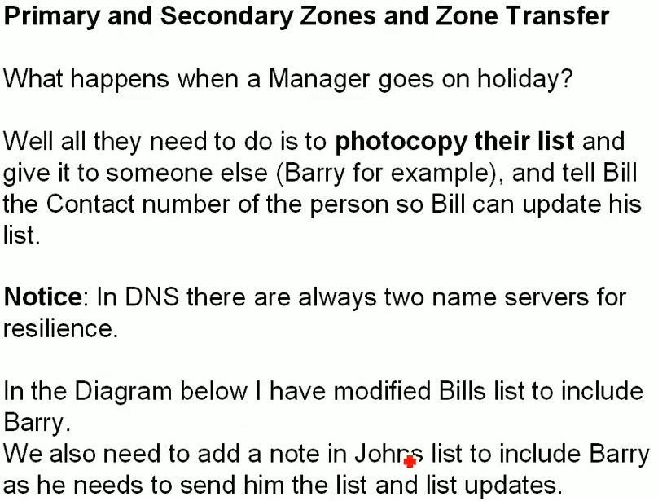
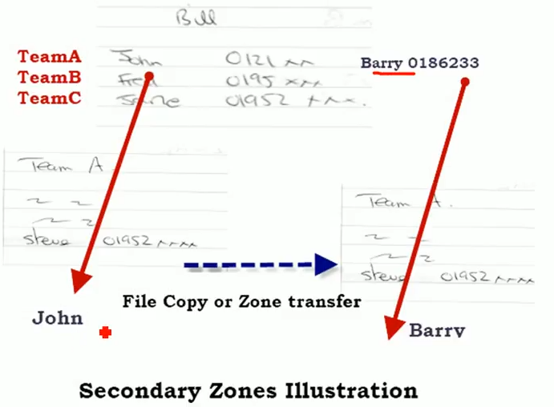
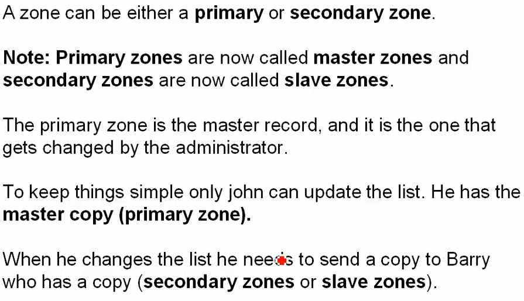

# 1.5 DNS Zone transfers - Theory

**Example Link :** [**https://www.youtube.com/watch?v=JDc9IZVFLm0**](https://www.youtube.com/watch?v=JDc9IZVFLm0)

**\*\) Why do we split in different zones, instead of one big zone?**

For every zone we need a name server \(NS\). For every NS there is a zone file present. We need to split the complete hierarchy into different zones, as the complete zones is very large. Splitting the zone means, splitting the large and huge zone file among several zones.

This mean, what if one of the NS in the DNS hierarchy goes down, or stops working, then how will his branch query will be resolved?

* First of all, we need to make a complete copy of zone file of john, and give this copy to Barry. But in John's zone list there is no mention of Barry. The location of Barry is only known by root NS.
* So what john does is, it queries root node for the location of Barry, then it includes this received information in its zone file.
* Then only john can send or is able to send its zone file information to Barry.
* Now we also need to tell Bill, that if John is not available then its job will be handled by  Barry, **this is what is called a zone transfer.**

